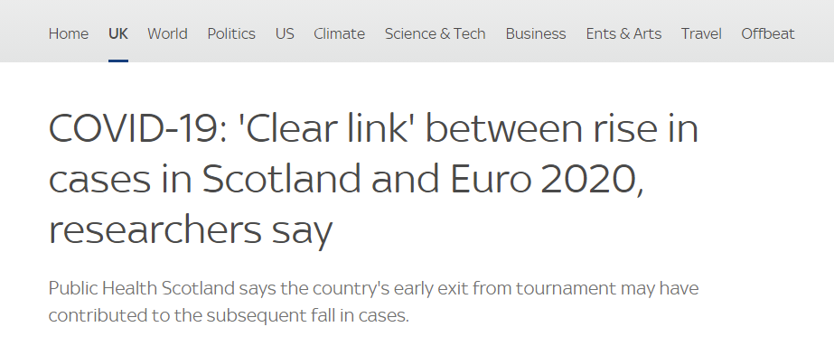

```{r setup, include=FALSE}
knitr::opts_chunk$set(echo = TRUE, warning=FALSE)
```

## Did the Euro 2020 matches cause more spread of Covid-19

The UK government chose to allow large crowds at the Euro2020 matches. Many newspapers claimed this contributed to higher covid cases over the next few days. Before looking at any of the data, think about your prior: do you think this is likely to be true? How confident are you that you are right? 


\vspace{48pt}

We can view match days as natural experiments. In a controlled trial we would choose half of the population to go to a football match and the other half stay at home. Instead we have some days where people were going to football matches, and some where they are not. 

*Stop and discuss:*
Is this a good idea for a natural experiment?
What we would expect to see in the case numbers if the newspapers hypothesis is right?
What you would expect to see if they were wrong?

```{r message=FALSE, warning=FALSE}
library(readr) ## loads csv files fast
England<-read_csv("England_cases.csv")
```
```{r}
summary(England) # look at the data
head(England)
England$Date<-as.Date(England$Date, "%d/%m/%Y") # fix the text date so it knows it is a date
```
This dataset contains two variables: Date ranging from 1st May to 7th August 2021, and Cases telling us how many people tested positive for Covid on that day in England.  

Let's plot out the cases and mark the various match days


```{r}
# create a list of potential match dates
matchdates=data.frame(dates =seq(as.Date("2021-06-11"), as.Date("2021-07-11"), by="days") )
# all dates with games played
matchdates$games<- ifelse((matchdates$dates<=as.Date("2021-06-23")) |  
                            (matchdates$dates>=as.Date("2021-06-26") & matchdates$dates<=as.Date("2021-06-29")) |
                            (matchdates$dates>=as.Date("2021-07-02") & matchdates$dates<=as.Date("2021-07-03"))|
                            (matchdates$dates>=as.Date("2021-07-06") & matchdates$dates<=as.Date("2021-07-07")) |
                            (matchdates$dates>=as.Date("2021-07-11") ),1, 0)

# results taken from https://www.uefa.com/uefaeuro-2020/news/0254-0d41684d1216-06773df7faed-1000--all-the-euro-2020-results/

library(ggplot2) # load graphing library

ggplot(data=England) + 
  geom_line(aes(x=Date, y=Cases)) +
  geom_vline(data=matchdates[matchdates$games==1,], aes(xintercept= dates), colour="green")  # add individual matches
```

\vspace{48pt}
What do you see in this graph? 

###  {.tabset .tabset-fade .tabset-pills}
####
\vspace{48pt}

#### Answer

There is a rise in cases while the games are happening. 
However, there is also a rise just before and after the games finish.
There are also frequent dips in the number of cases.
There is not an obvious correspondance between when a match happens and when these spikes are happening.


### \vspace{48pt}


*"Post hoc ergo propter hoc"* 
is a latin phrase meaning 'after this, therefore because of this' - this is sometimes called the post hoc fallacy. 
While it is nessisary for something to happen before an event to be a cause, but is not sufficient. 
For example: I fall asleep before the movie ends, therefore my falling asleep causes the end of the movie. 

While the games happen just before the highest case numbers, doesn't mean that is good evidence that it caused the peaks. 

One thing we could try is shifting the dates, as Covid takes on average 4 days to be diagnosed from infection.
We could also try looking at whether the game being played in England, or having England as one of the teams makes a difference

```{r}

# all dates played in London
matchdates$London<-ifelse(matchdates$dates==as.Date("2021-06-13") | 
                            matchdates$dates==as.Date("2021-06-18") |
                            matchdates$dates==as.Date("2021-06-22") |
                            matchdates$dates==as.Date("2021-06-26") | 
                            matchdates$dates==as.Date("2021-06-29") |
                            matchdates$dates==as.Date("2021-07-06") | 
                            matchdates$dates==as.Date("2021-07-07") |
                            matchdates$dates==as.Date("2021-07-11") ,
                            "In London", "Not In London")
# all dates played by England

matchdates$England<-ifelse(matchdates$dates==as.Date("2021-06-13") | 
                            matchdates$dates==as.Date("2021-06-18") |
                            matchdates$dates==as.Date("2021-06-22") |
                            matchdates$dates==as.Date("2021-06-29") |
                            matchdates$dates==as.Date("2021-07-03") | 
                            matchdates$dates==as.Date("2021-07-06") |
                            matchdates$dates==as.Date("2021-07-11") ,
                           "England Match", "Other")

# shifted dates for covid infection

matchdates$coviddates<- matchdates$dates + 4

```

Experiment with these new variables -  do they tell a more convincing story?


###  {.tabset .tabset-fade .tabset-pills}
####
\vspace{48pt}

#### Code 

```{r eval=FALSE, echo=TRUE, warning=FALSE}
ggplot(data=England) + 
  geom_line(aes(x=Date, y=Cases)) +
  geom_vline(data=matchdates[matchdates$England=="England Match",],
             aes(xintercept= coviddates,
                 colour= England,
                 linetype= London))  # add individual matches

ggplot(data=England) + 
  geom_line(aes(x=Date, y=Cases)) +
  geom_vline(data=matchdates[matchdates$London=="In London",],
             aes(xintercept= coviddates,
                 colour= England,
                 linetype= London))  # add individual matches

```

#### Answer
\vspace{48pt}
```{r echo=FALSE}
ggplot(data=England) + 
  geom_line(aes(x=Date, y=Cases)) +
  geom_vline(data=matchdates[matchdates$England=="England Match",],
             aes(xintercept= coviddates,
                 colour= England,
                 linetype= London))  # add individual matches

ggplot(data=England) + 
  geom_line(aes(x=Date, y=Cases)) +
  geom_vline(data=matchdates[matchdates$London=="In London",],
             aes(xintercept= coviddates,
                 colour= England,
                 linetype= London))  # add individual matches
```

The rise in cases drops off quickly after the games end, and there is some correspondance between the highest peak and it being 4 days after the final match.  However sometimes 4 days after a match there is a dip instead, and the cases were clearly rising before the matches even start.

### \vspace{48pt}

How convincing do you find these?

## Is it just England?


Some researchers hypothesized that if there is an effect, it should fade out after a country exits from the tournament or once there are no longer any matches held in that country.
Others have said that the pattern will persist so long as people can gather to watch the match in pubs or people's homes. 

Let's look at the patterns across Europe. What would we expect to see in different countries under different hypotheses?

```{r}
 Europe_daily <- read_csv("Europe_daily.csv", 
                          col_types = cols(Date = col_date(format = "%Y-%m-%d"))) # a different way to tell R this column is a date
summary(Europe_daily)
head(Europe_daily)
unique(Europe_daily$Country) # list the different countries in the data set
```
This data set contains the same information for a selection of European countries. 
Try plotting out the cases per day for all the countries and colouring it by country. 
(Hint: use the code from the last section)

It's a bit of a mess when there is this much going on. 
Also, the rates are too low to see in a lot of the countries
Pick 3 or 4 countries and subset down to those ones (pick different ones to me!)

It is clearly very difficult to compare countries because they have different scales of cases. 
We could rescale to the % of cases they had in the country at the start of tournament (Alternatively we could use population to rescale)


```{r}
Countries <- c("Scotland", "Slovakia","Spain","Sweden" ) # pick countries
Europe_daily_subset<- Europe_daily[Europe_daily$Country %in% Countries,]

Exit_dates<-as.Date(c( "2021-6-22", "2021-06-23","2021-07-02", "2021-06-29")) # add exit dates from the tournament
Exit_coviddates<-Exit_dates + 4 # to allow for detection

Exits<-data.frame(Country=Countries, Exit = Exit_coviddates)

Initial<- Europe_daily_subset[Europe_daily_subset$Date=="2021-06-11", c("Country", "Cases")] 
names(Initial)<- c("Country", "Initial")
# find initial case rates


Europe_subset<-merge(x= Europe_daily_subset, y= Initial, by= "Country")
Europe_subset$Perc_Cases<- Europe_subset$Cases/Europe_subset$Initial*100


```

Graph the cases in these countries & mark on the exit dates. You may want to consider use of the facet_wrap command to seperate the different countries.  

###  {.tabset .tabset-fade .tabset-pills}
####
\vspace{48pt}

#### Code 

```{r eval=FALSE, include=TRUE}

ggplot(data=Europe_subset) + 
  geom_line(aes(x=Date, y=Perc_Cases, colour=Country)) +
  geom_vline(data=Exits,
             aes(xintercept= Exit,
                 colour= Country), linetype=2)+
  facet_wrap(facets=vars(Country))
```


#### Image

```{r eval=FALSE, include=TRUE}

ggplot(data=Europe_subset) + 
  geom_line(aes(x=Date, y=Perc_Cases, colour=Country)) +
  geom_vline(data=Exits,
             aes(xintercept= Exit,
                 colour= Country), linetype=2)+
  facet_wrap(facets=vars(Country))
```

It is worth noting that many of the countries have a drop in reporting at the weekend, followed by a spike on the following Monday - this makes it difficult to attribute effects to specific days and spot underlying trends.  This is often fixed by smoothing the data - taking the average of the last 7 days for example.

### \vspace{48pt}

Is there any evidence of covid rising while a country in the Euro 2020 tournament and dropping once their team stops competing?


It may not be fair to compare countries directly without accounting for other attributes that could influence the effects - what other data might you want to collect about each country to make sure Euro2020 was the main driver of an effect?
\vspace{48pt}

## Adding Age and Sex
\vspace{48pt}


```{r echo=FALSE, fig.alt="Surge in Covid cases amoung English men in their 20s - coinciding with Euro 2020"}

```

\vspace{48pt}

More men than women attend football matches (2014/2015 Premier league audience figures estimated only 26% of match attenders are women). Perhaps the effect of football matches is only see in certain subsections, and the rest of the data is hiding the effect.  Let's use a data set with more of a breakdown of the figures.

``` {r}
Nations_Sex <- read_csv("Nations_age_sex.csv", col_types = cols(Date = col_date(format = "%d/%m/%Y")))
summary(Nations_Sex)
head(Nations_Sex)
```

This a a dataset of the number of new Covid19 cases in Scotland, England and France split by age and sex between May 1st and August 7th 2021. It is worth noting that the age ranges are not consistent between countries

```{r}
table(Nations_Sex$AgeGroup, Nations_Sex$Country)
```

Investigate this data set. Some approaches you may like to think about & useful functions


* You could use women as a model for what "no football" covid rates should be, and compare to the male rates. This could be done by comparing raw numbers and arguing that if there were no football male numbers should be the same as womens. Or by looking at what % of total cases are male and arguing that this % should be consistent over time. 

```{r}
Nations_Sex$Male_excess <- Nations_Sex$Male -Nations_Sex$Female
Nations_Sex$Male_percentage <- Nations_Sex$Male/Nations_Sex$Total*100
```
* You could sum up the data over specific categories e.g. to get daily male totals 
```{r}
All_male<-aggregate(Nations_Sex$Male, by=list(Date=Nations_Sex$Date, Country=Nations_Sex$Country),FUN=sum)
```
* You could subset down to specific ages only, and make similar arguments with different ages groups as with men vs women
```{r}
All_kids<-Nations_Sex[Nations_Sex$AgeGroup %in% c("0-14", "0-4", "0-9", "10-14"),]

All_20s<-Nations_Sex[Nations_Sex$AgeGroup %in% c("20 to 24", "20 to 29", "25 to 29", "25 to 44"),]

All_60plus<-Nations_Sex[Nations_Sex$AgeGroup %in% c("60 to 64", "60 to 69", "60+", "65 to 69","70 to 74","70 to 79", "75 to 79", "80 to 84", "80 to 89", "85 to 89", "90+"),]
```

You may find using facets or groups a useful way to visualize what is happening - as in the nations example in the previous section.

You could even look for additional data - such as a regional breakdowns within the UK byt looking online for suitable datasets. 

Have a play with the data - can you find a convincing natural experiment for or against the hypothesis that football matches caused a rise in cases? What would be your advice to the government on whether to allow another similar sporting competition?


## Data Origins and references

English data downloaded from : https://coronavirus.data.gov.uk/details/download
Scottish data from: https://publichealthscotland.scot/publications/covid-19-statistical-report/covid-19-statistical-report-11-august-2021/dashboard
EU data from https://www.ecdc.europa.eu/en/cases-2019-ncov-eueea
France data from: www.data.gouv.fr/fr/datasets/donnees-relatives-aux-resultats-des-tests-virologiques-covid-19/

All data sets have been rearranged, summerised or combined by Amy Mason to produce the final sets. 

Concept based on analysis by Alex Selby @alexselby1770 (Please don't look up his work until the end of the exercise)
at https://twitter.com/alexselby1770/status/1417516389464776715 

